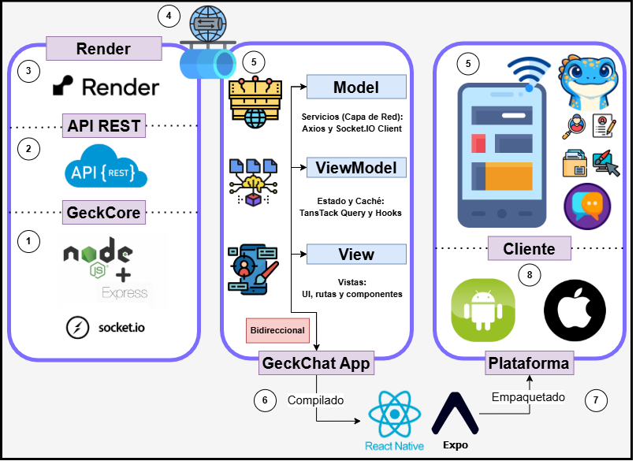

# 🦎 GeckChat - Mobile App

**GeckChat** es el componente móvil nativo del ecosistema [GeckOS](https://geck-os.netlify.app/). Esta aplicación unifica una plataforma de mensajería instantánea y colaboración en tiempo real, ofreciendo chats privados, espacios de trabajo grupales (Workspaces), intercambio de archivos multimedia y un sistema de personalización de interfaz de alto nivel.

---

## 🎓 Contexto Académico

* **Institución:** Escuela Politécnica Nacional del Ecuador
* **Facultad:** Escuela de Formación de Tecnólogos (ESFOT)
* **Carrera:** Tecnología Superior en Desarrollo de Software
* **Año:** 2026
* **Desarrollado por:** Brandon Vinicio Huera Torres

---

## 🌐 El Ecosistema GeckOS (Sistema Hermano)

**GeckChat** no existe en el vacío; es la extensión móvil y nativa de **GeckOS**, una plataforma web robusta de gestión y colaboración corporativa y académica. Puedes visitar, explorar e interactuar con el sistema web hermano aquí:

👉 **[Visitar GeckOS en la Web (https://geck-os.netlify.app/)](https://geck-os.netlify.app/)**

---

## 🚀 Stack Tecnológico

El proyecto ha sido construido utilizando las mejores y más modernas herramientas del desarrollo móvil y web:

**Frontend (Móvil):**
* **Framework:** React Native con Expo (SDK 54)
* **Navegación:** Expo Router (Enrutamiento basado en archivos)
* **Estilos y UI:** NativeWind (Tailwind CSS para React Native) y Glassmorphism
* **Animaciones:** React Native Reanimated (Micro-interacciones, físicas elásticas "Squish" y transiciones)
* **Gestión de Estado y Caché:** React Query (@tanstack/react-query) para actualización optimista.
* **Multimedia nativa:** Expo Audio, Expo Image Picker, Expo Document Picker.

**Backend & Conectividad:**
* **Tiempo Real:** Socket.io-client (Sincronización instantánea de mensajes, notificaciones y estados).
* **Peticiones HTTP:** Axios (con interceptores para gestión de JWT).
* **Almacenamiento en la nube:** Integración con Cloudinary (vía API backend) para imágenes y notas de voz.

---

## 🏗️ Arquitectura de la Aplicación

El proyecto se estructura bajo un enfoque de **Arquitectura en Capas** y flujos reactivos mediante el patrón **MVVM (Model-View-ViewModel)**. Esto permite desacoplar totalmente la interfaz gráfica (React Native) del manejo de estado global en caché (TanStack Query) y del acceso a datos externos (Axios/Socket.IO).



---

## 🛠️ Características Principales

* **Mensajería en Tiempo Real & UI Optimista:** Comunicación fluida sin latencia perceptible. Los mensajes se dibujan al instante en pantalla antes de siquiera recibir la confirmación del servidor.
* **Workspaces Colaborativos:** Creación de grupos de trabajo con gestión de miembros en vivo.
* **Trazabilidad de Mensajes:** Conoce en tiempo real exactamente qué participante del grupo ha recibido y quién ha leído tu mensaje con un desglose visual de perfiles.
* **Notas de Voz Inteligentes:** Interfaz de grabación fluida con soporte para mantener presionado, cancelación de gestos y envío automático.
* **Gestor de Documentos:** Sistema integrado para compartir, visualizar y descargar archivos (PDF, Excel, Word, etc.).
* **Burbujas Inteligentes de Notificación:** Alertas visuales dinámicas (puntitos naranjas) en las pestañas que te avisan si tienes mensajes sin leer en otras áreas.
* **Personalización (Theming):** Modo claro/oscuro automatizado y la capacidad de modificar los fondos de chat de forma global, incluyendo fotos de la galería personal.
* **UX/UI Premium:** Componentes responsivos que respetan los *Safe Areas* (Notch e Indicadores de Home) tanto en iOS como en Android, junto con soporte calibrado de teclado (`KeyboardAvoidingView`).

---

## 📦 Indicaciones Generales (Para Desarrolladores)

Si deseas clonar y correr este proyecto en un entorno local, sigue estos pasos:

### 1. Requisitos Previos
* Node.js instalado (v18 o superior).
* Cuenta de [Expo](https://expo.dev/) activa.
* Emulador de Android/iOS o la aplicación **Expo Go** instalada en un dispositivo físico.

### 2. Instalación y Configuración
Clona el repositorio e instala las dependencias:
```bash
git clone https://github.com/brandonvht26/geck-chat.git
cd geck-chat
npm install
```

Crea un archivo `.env` en la raíz del proyecto basándote en el archivo de ejemplo:
```bash
cp .env.example .env
```
Asegúrate de llenar la variable `EXPO_PUBLIC_API_URI` con la URL de tu backend de GeckOS (ej. `http://tu-ip-local:3000` para desarrollo).

### 3. Ejecución Local
Para levantar el servidor de desarrollo de Metro Bundler:
```bash
npx expo start -c
```
Esto abrirá una interfaz en tu terminal y en tu navegador. Puedes escanear el código QR con la aplicación **Expo Go** desde tu teléfono para probar la aplicación en vivo.

### 4. Compilación del APK (Producción)
GeckChat está configurado para ser construido utilizando los servicios de la nube de Expo (EAS). Para generar el archivo instalable de Android (`.apk`):

1. Instala la CLI de EAS:
```bash
npm install -g eas-cli
```
2. Inicia sesión en tu cuenta de Expo:
```bash
eas login
```
3. Ejecuta el comando de construcción asociado al perfil "preview":
```bash
eas build -p android --profile preview
```
El proceso subirá el código a la nube y, tras unos minutos, te proveerá de un enlace directo para descargar e instalar el `.apk` en cualquier dispositivo Android.